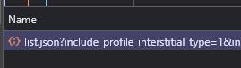

# Export Twitter Following

This script will export any users a given user is "following" to a json file for your viewing pleasure.
This can also be used to export the followers & verified followers of any given account (check -help)

## Prerequisites

- Node.js
- A Twitter account
- Some time

## Usage

You'll need to obtain the following:
- Your cookie
- An x-csrf-token
- The user Id of whoever you want to export the following of

If you need help finding these, see the [Extra Info](#extra-info) section

### Steps
1. Clone the repository
2. Make a cookie.json, .env and fill them out
3. Run `npm i`
4. Run `tsx index.ts` (or whatever you want to use to run it im not your dad)
5. Follow the prompts, or input the values as arguments 
6. Wait a bit
7. It should export a json file to the same directory as the script called following.json
8. Have fun

## Extra Info

### Cookie 
The cookie should be formatted as it is in the cookie.json.example file - use something like [this](https://chromewebstore.google.com/detail/cookie-editor/hlkenndednhfkekhgcdicdfddnkalmdm) to export your cookie. If you're using this one just open it on twitter and hit export at the bottom right in the extension.

### User id & x-csrf-token
If you need help finding the user id, open up the network tab in devtools on the page of the person you want to export and look for a request called "list.json" with some stuff after it - should look like this: 

Alternatively, you can use this website to get the user id from their @: https://tweethunter.io/twitter-id-converter

Click on the request to open it up, you can see it as a parameter in the url. You can also obtain the x-csrf-token from the request headers if you scroll down a bit in this same request, copy it and stick it in your .env file.

### Errors

If you get a 353 error, you're probably using an old cookie or a mismatched csrf token and cookie ct0 token. You can try to get a new one by running the steps above again and inputting your new cookie + replacing the x-csrf-token with the one from the new request headers.
